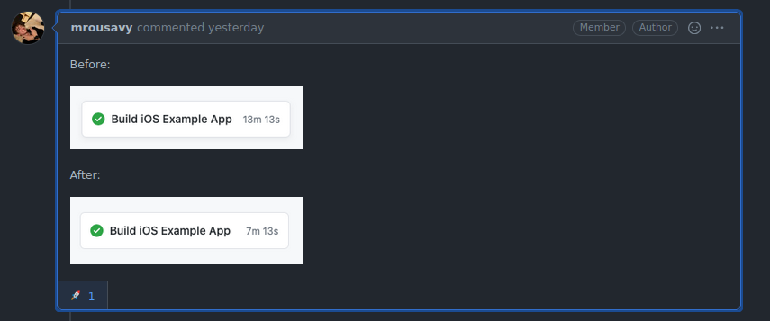

# Accelerate builds using buildcache

Use this GitHub Action to accelerate compilation in your GitHub workflows using [buildcache](https://github.com/mbitsnbites/buildcache)



## Usage

1. Workflow integration
1. Build integration
1. ??
1. Profit

### Workflow Integration

#### Default Style

The defaults fit most projects well.

The defaults definitely fit react-native projects well.

```yaml
jobs:
  ios:
  runs-on: macos-latest # also runs on ubuntu and windows
  steps:
    - uses: mikehardy/buildcache-action@v1
```

- 500MB cache, cache is in `$GITHUB_WORKSPACE`, just needs build integration and you're set!

When using with `actions/checkout@v2`, add this action as a step after the checkout, or the `buildcache` binary will be clobbered in the post-job cleanup of the checkout action:

```yaml
steps:
  - uses: actions/checkout@v2
  - uses: mikehardy/buildcache-action@v1
```
#### Customize if you need to

All [buildcache options](https://github.com/mbitsnbites/buildcache/blob/master/doc/configuration.md) are available to override via environment variables set in the workflow env area

A few options are used internally by this action, but if you override them this action will respect the override you have set.

```yaml
jobs:
  ios:
    env: # overrides: https://github.com/mbitsnbites/buildcache/blob/master/doc/configuration.md
      BUILDCACHE_DIR: ../.buildcache # optional: Put the cache somewhere else
      BUILDCACHE_DEBUG: 2 # optional: If you need more logging?
      BUILDCACHE_MAX_CACHE_SIZE: 1000000000 # optional: Need a bigger cache?
      BUILDCACHE_LOG_FILE: ../buildcache.log # optional: Log where you like
  runs-on: macos-latest
  steps:
    - uses: mikehardy/buildcache-action@v1
      with:
        cache_key: ${{ matrix.os }} # optional: separate caches maybe?
        upload_buildcache_log: 'true' # optional: 100% cache misses? Find out why
        zero_buildcache_stats: 'false' # optional: lifetime vs per-run stats?
```

### Build Integration

buildcache is available now, but is unused until you call `clang` and`clang++` wrapped by buildcache.

Xcode puts `clang` and `clang++` on your `PATH` (in `/usr/bin`), and this action puts buildcache wrappers for it in your `PATH` first, before the normal Xcode ones.

This `PATH` manipulation is the key to an easy build integration.

You may rely on calling `clang` and `clang++` from `PATH` at all times, instead of via fully-specified paths. In environments where buildcache is availble, it will work. In environments that do not have buildcache, _it will still work_

#### Minimal change: override compiler on command line

If you want to isolate the integration to the Github Actions CI environment, run your Xcode build using specific overrides.

```sh
xcodebuild CC=clang CPLUSPLUS=clang++ LD=clang LDPLUSPLUS=clang++ <all other parameters>`
```

Here is [a real example of a project integrating it](https://github.com/cuvent/react-native-vision-camera/pull/131/files) this way

#### Maximum change: allow buildcache use everywhere

After seeing the acceleration, you may want to use buildcache locally as well (I do!)

This is possible if you change your project definition to override the compiler to use the value from `PATH` all the time. This should be backwards-compatible - it should still work on machines that do not have buildcache installed, but it is more intrusive because it changes your Xcode project file.

You can may do this via a `Podfile` hook like this:

```ruby
    installer.pods_project.targets.each do |target|
      target.build_configurations.each do |config|
        config.build_settings["CC"] = "clang"
        config.build_settings["LD"] = "clang"
        config.build_settings["CXX"] = "clang++"
        config.build_settings["LDPLUSPLUS"] = "clang++"
      end
    end

```

## Verification

How do you know it is working?

The overall buid time should make it obvious, but the real test is your cache hit/miss rate.

To verify things are working using the default configuration, look at the output of the workflow run, expand the "Post buildcache" step and check the statistics printed out. If you you "Re-run jobs" using the GitHub Actions web interface to re-run a job a second time, you _should_ see 100% hit rate, on quite a few objects.

The output of this repositories [react-native compile test action](https://github.com/mikehardy/buildcache-action/actions/workflows/react-native-build-test.yml) are a good example.

If you need more information, the default `BUILDCACHE_DEBUG` level of `2` is likely enough, you just need to add the `upload_buildcache_log` flag to your workflow integration and set it to `true`, then you may examine the actual output of buildcache as it worked, using the logfile attached as an artifact to the workflow run. If that still is not enough you may need a debug level of `1` See [Debugging Buildcache](https://github.com/mbitsnbites/buildcache/blob/master/doc/configuration.md#debugging) for more information.

In practice, that is all I have needed to do to be certain the integration was successful in other projects.

## Benchmarks - 40-50% improvement

iOS compile performance improvements of approximately 40-50% may be expected when using this action

- macos-latest, warm cache, react-native-firebase app with all modules: 5min 52s (vs 10min)
- macos-latest, warm cache, react-native 0.64 demo app without Flipper: 2min 55s (vs 5min 20s)
- macos-latest, warm cache, react-native-vision-camera: [7min 13s (vs 13min 13s)](https://github.com/mrousavy/react-native-vision-camera/pull/131#issuecomment-832687144)

The _first_ build - the "cold" cache case - will be slower by around 15%, since buildcache has overhead to determine if it can use the cached object or not. On the cache miss case it then delegates to the compiler and stores the object for the next run which takes longer than a normal compile call.

## Implementation Details

### Approach

This action does these things - if they interact poorly with your project, perhaps they could be altered slightly and made to work better if you propose a PR:

- fetches the latest version of [buildcache](https://github.com/mbitsnbites/buildcache)
- installs it in your project directory as `buiildcache/bin/buildcache`
- makes symoblic links from `buildcache` to `clang` and `clang++`
- adds that directory to your `$GITHUB_PATH` for future steps
- configures the cache directory (defaults to `.buildcache` in your project directory if not set via environment variable)
- configures buildcache storage limit (defaults to 500MB if not set via environment variable)
- restores previous caches, and at the end saves the current one
- turns on `BUILDCACHE_DEBUG=2` if not set in environment variable
- will upload debug log if `BUILDCACHE_DEBUG` is not -1 and if `upload_buildcache_log` is true
- zeros cache stats by default after restore, so you get clean stats per-run, `zero_buildcache_stats` can disable it

### Things that don't work

- Direct mode did not work in testing when compiling react-native apps. Dependency files aren't created, but are needed. Direct mode is not enabled.
- `ccache` did not work when compiling react-native apps. It can't handle "multiple source files" so cache misses all the time.
- copying `buildcache` to `clang` and `clang++`, it has to be symbolic links. This means this is not quite a drop-in replacement on windows

## Contributing

If you set up a personal access token on GitHub, then export it as well as a couple other items, the whole thing runs well from a local mac for development.

```bash
alias buildcache-action-exports='export GITHUB_TOKEN=PERSONALACCESSTOKENHERE; export RUNNER_TEMP=`pwd`/__tests__/runner/TEMP; export RUNNER_CACHE=`pwd`/__tests__/runner/CACHE; export GITHUB_WORKSPACE=`pwd`/__tests__/runner/WORKSPACE'
```

I usually have two terminals open side by side, one with `yarn build-watch` and one to run `yarn test`

PRs are welcome. This action is new and is in the "works for me" and "works for react-native-firebase" state, so it _is_ useful, but maybe not generic enough to be useful for others yet.

## Inspiration + Gratitude

I work on [react-native-firebase](https://rnfirebase.io) and [FlutterFire](https://github.com/FirebaseExtended/flutterfire/) for [Invertase](https://invertase.io) and they have a truly inspiring dedication to automated testing. I sincerely love it, but...CI is slow for iOS testing!

I was inspired to try iOS compile acceleration after seeing [Codified](https://getcodified.com/services/) applying ccache with 10-20% improvements to CI Xcode builds, but it wasn't packaged up or redistributable

I then found [ccache-action](https://github.com/hendrikmuhs/ccache-action) - Henrik has done a great job there! Unfortunately in my testing with react-native projets ccache did not speed things up much because ccache misses cache on "multiple_source_files" compile calls, and that is seemingly all react-native projects do. `ccache-action` was the inspiration for this action though, thanks Hendrik!

Then I found [buildcache](https://github.com/mbitsnbites/buildcache) and saw with a quick test I could achieve nearly 50% performance improvements

Combining the motivation to try it, the template of the idea already existing with ccache, and the good performance of buildcache and here we are.
